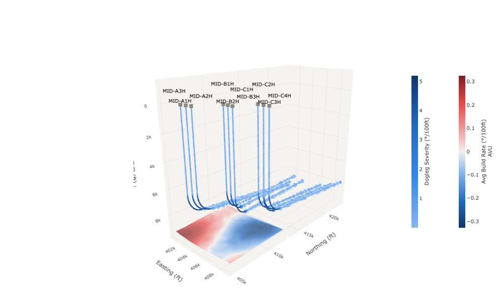

# 3D Well &amp; Completion Viewer — Sigma plugin

An interactive 3D subsurface viewer for Sigma workbooks: well trajectories in
Easting / Northing / TVD space, coloured by any drilling or completion metric,
with optional frac-stage markers and a heat-mapped formation-top surface.
Orbit, zoom and pan with the mouse; filter and select wells from the panel;
clicking a well writes back to a Sigma control so the rest of the workbook filters.

Built to replace the standalone Plotly HTML files subsurface teams keep in
OneDrive — same interaction model, but reading live Sigma data.



---

## Data shape

Two elements feed the plugin. Only the first is required.

**1. Well survey (required)** — one row per survey station:

| role | example column | notes |
|---|---|---|
| Well / UWI | `WELL_NAME` | groups rows into trajectories |
| Easting / X | `EASTING_FT` | any planar CRS; lat/long also works |
| Northing / Y | `NORTHING_FT` | |
| TVD / depth | `TVD_FT` | plotted downward (axis is reversed) |
| Measured depth | `MD_FT` | orders the stations along the path |
| Colour metric | `DOGLEG_SEVERITY_DEG_100FT` | any numeric — DLS, build rate, ROP, WOB, gamma… |
| Stage size metric | `PROPPANT_LBS` | non-null rows get a stage marker sized by this |
| Stage label | `FRAC_STAGE` | shown in the stage tooltip |
| Extra hover columns | `ROP_FT_HR`, `PAD`, … | any number, appended to the tooltip |

**2. Formation grid (optional)** — one row per grid node, per formation:

| role | example column |
|---|---|
| Layer / formation | `FORMATION` |
| Easting / X | `EASTING_FT` |
| Northing / Y | `NORTHING_FT` |
| Top depth | `TOP_TVD_FT` |
| Colour metric | `AVG_BUILD_RATE_DEG_100FT` |

The grid is triangulated in plan view, so it does not have to be a regular
lattice — scattered control points work.

`sample_data/` has both tables ready to upload to Sigma
(`python3 gen_sample_data.py` regenerates them): 10 wells on 3 pads, ~50 frac
stages each, 3 formation tops.

---

## Quick start

```bash
python3 -m http.server 8127
```

Run that from the `plugins/` directory, then register the plugin in Sigma
(**Administration → Plugins → Add plugin**, or via the API):

```bash
python3 ../../scripts/register_plugin.py "$SIGMA_BASE_URL" "$SIGMA_API_TOKEN" \
  "3D Well & Completion Viewer" "http://localhost:8127/chevron-well-3d/"
```

Then in a workbook:

1. Add a **Plugin** element and pick *3D Well & Completion Viewer*.
2. Set **Source** to the well-survey table.
3. Turn on **Edit mode** — a mapping bar appears above the chart. It auto-maps
   columns by name on first load (easting/northing/tvd/md/well/dls/proppant…);
   fix anything it guessed wrong, then **Save mapping**.
4. Optional: set **Surface source** to the formation-grid table and map its five
   columns.
5. Turn **Edit mode** off. Viewers get the control panel, not the mapping bar.

For a look at it before wiring up data, flip on **Use built-in demo wells**, or
just open `index.html` in a browser — outside Sigma it renders the demo pad.

### Editor panel

| entry | purpose |
|---|---|
| Source | the well-survey element |
| Well survey columns | auto-managed; the plugin registers whatever the mapping uses |
| Surface source | the formation-grid element (optional) |
| Formation grid columns | auto-managed |
| Clicked well → control | text control that receives the selected well name (`''` when cleared) |
| Clicked well → action | action fired after the control is set — point it at a filter or navigation |
| Selected layer → control | text control that receives the chosen formation |
| Viewer config (JSON) | the saved mapping + default view; the plugin writes this, you rarely touch it |
| Edit mode | shows the mapping bar and *Save view as default* |
| Use built-in demo wells | ignore the bound data, render the sample pad |

---

## Viewer controls

- **Formation layer** — which formation top to drape (from the grid element's layer column).
- **Colour scale** — Auto picks diverging for metrics that cross zero (build rate,
  variance) and single-hue sequential for pure magnitude (DLS, ROP). Override either way.
- **Depth exaggeration** — 0.2×–3×. The camera refits so the scene stays framed.
- **True scale (1:1:1)** — geologically honest proportions; disables exaggeration.
- **Camera** — Iso / Plan (N up) / Section presets, plus free orbit.
- **Orthographic** — for section-style measurement without perspective foreshortening.
- **Completion stages / Formation surface / Well labels / Plan-view footprint** — layer toggles.
- **Wells** — tick to show/hide, click a name to select. Selecting also dims the
  other trajectories and writes the well name to the bound Sigma control.

Clicking a trajectory or a stage marker in the 3D view selects it too. Sigma
filters applied upstream (page controls, cross-element filters) flow straight
through — the plugin only ever draws the rows it is given.

---

## Design notes

- **Colours** follow the house data-viz palette: one-hue blue sequential for
  magnitude, blue↔red diverging with a neutral midpoint for polarity, and the
  eight-slot categorical order when colouring by well. Line marks use a
  floor-lifted ramp (sequential starts at step 250, the diverging midpoint is a
  mid grey) because the lightest steps disappear at 2 px against the surface.
- **Identity is never colour-alone** — every visible well carries a wellhead
  label and a hover tooltip, which is also what makes the 9th-plus well legible
  when colouring by well (those fall back to neutral grey; colour by a metric or
  filter down instead).
- **One colour bar per encoding**, sitting beside the scene: the trajectory
  metric and the surface metric each get their own, and the scene domain shrinks
  to make room rather than overlapping them.
- **Decimation** — trajectories longer than 3,000 stations are strided down
  (endpoints kept) so orbiting stays at frame rate. Sigma's own plugin row limit
  applies first; aggregate or filter upstream for very large well sets.
- **Resize** — Sigma sizes the iframe after first paint, and Plotly's
  `Plots.resize` leaves the WebGL scene fitted to the old box, so the plugin does
  a debounced full redraw on every size change.

---

## Troubleshooting

| symptom | cause |
|---|---|
| "3D engine failed to load" | the org blocks `cdn.plot.ly`. Download `plotly-gl3d-2.35.2.min.js` next to `index.html` and point the `<script>` tag at it. |
| "Plugin SDK failed to load" | `unpkg.com` is blocked — vendor `react` and `@sigmacomputing/plugin` the same way. |
| A mapped column shows `—` | Sigma only delivers declared columns. The plugin registers them automatically on save; re-save the mapping if you hand-edited the config JSON. |
| Nothing renders, no message | check that Easting / Northing / TVD are all mapped to numeric columns and that some rows have all three non-null. |
| Labels overlap in Plan view | the vertical stagger can't separate labels when you look straight down the depth axis — turn **Well labels** off for plan work. |

---

## Testing it against real Sigma data

`build_test_workbook.py` builds a whole test workbook via the workbooks-as-code API —
10 wells, ~470 frac stages and 3 formation-top grids, all generated in-warehouse with
Snowflake generators, so it needs no source tables:

```bash
python3 build_test_workbook.py "$SIGMA_BASE_URL" "$SIGMA_API_TOKEN" <CONNECTION_ID> <PLUGIN_ID> <FOLDER_ID>
```

Add `--update <WORKBOOK_ID>` to re-publish over an existing one, or `PLUGIN_DEMO=1` to
build it with the plugin's demo toggle on. The workbook wires up:

- **Pad** and **Target formation** list controls filtering the survey table — the plugin
  redraws from whatever rows survive the filter.
- A **Selected well** text control bound to the plugin's `wellVar`, which filters the
  Completion Stages table underneath. Click a trajectory, the table follows.
- A **Formation layer shown** text control bound to `layerVar`.

### Sigma's PNG/PDF export does not give plugins row data

Worth knowing before you debug a blank plugin: in a server-side export
(`POST /v2/workbooks/{id}/export`), plugin iframes receive their config **and their
column metadata**, but **not the element's rows**. Verified by putting Sigma's own
sample bar-chart plugin on the same page — it drew its legend from the column names
and then no bars. So an exported PNG will always show this plugin's
"Waiting for survey data…" state even when the workbook is fine in the browser. Use
`PLUGIN_DEMO=1` if you want an export that actually shows the 3D scene.
